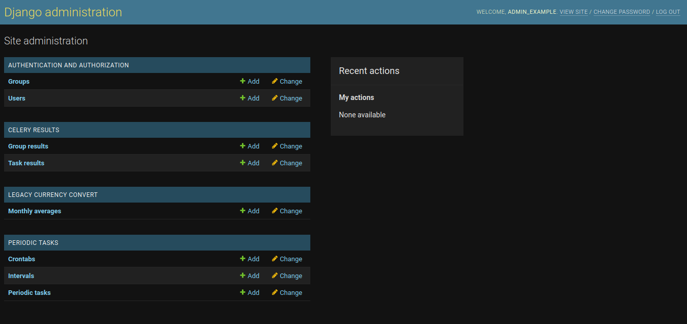
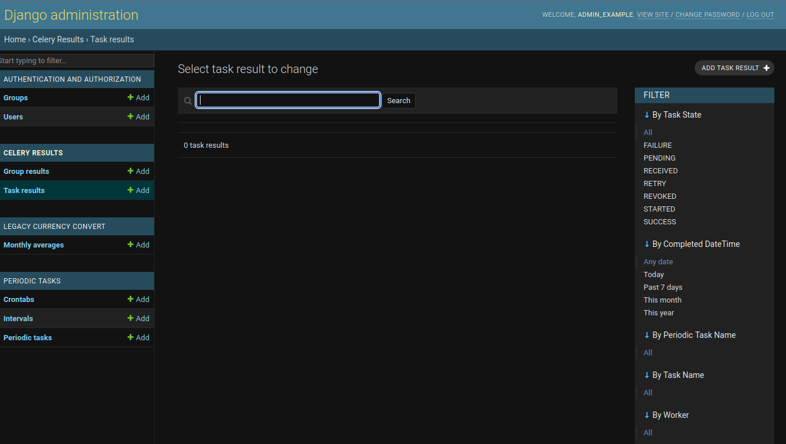
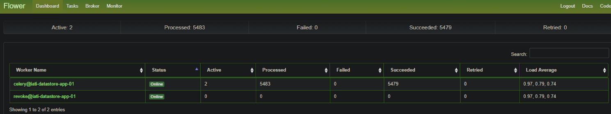
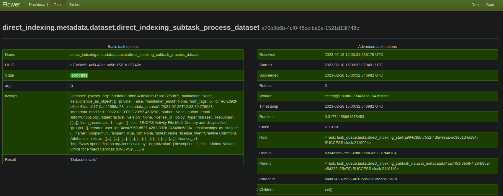

# Using IATI.cloud
- [Introduction](#introduction)
- [Administration](#administration)
    - [Celery results](#celery-results)
    - [Legacy currency convert](#legacy-currency-convert)
    - [Task manangement](#task-manangement)
        - [Tasks overview](#tasks-overview)
- [Querying data](#querying-data)
    - [Querying tips](#querying-tips)
- [Appendices](#appendices)
    - [1. Django admin interface](#1-django-admin-interface)
    - [2. Celery Task results](#2-celery-task-results)
    - [3. Celery Flower](#3-celery-flower)

---
## Introduction
This file will contain a guide to how to use IATI.cloud as an administrator, from zero to a fully indexed IATI dataset, as well as some tips on querying data.

## Administration
The IATI.cloud process is managed from Django. In the Django admin interface you can trigger the 'Periodic tasks', which execute things like clearing all of the Solr cores, indexing the entire IATI dataset, or indexing subsets, more about this in [tasks](#tasks).

The Django Administration interface, as seen in [appendix 1](#1-django-admin-interface) contains some user management, [celery results](#celery-results), [legacy currency convert](#legacy-currency-convert) and [periodic tasks](#task-manangement).

### Celery results
The [django celery results page](#2-django-celery-task-results) is similar to the [Celery Flower interface](#3-celery-flower), the interface shows all of the dispatched tasks and their states. Results can be read here as well. In the Celery Flower interface you can also terminate running tasks, in case of necessity. These interfaces should be used to inspect tasks and task results.

### Legacy currency convert
This is a feature that was developed initially for the IATI.cloud to enable currency conversion. It is a best-effort using the [International Monetary Fund's (IMF) monthly exchange rates in the form of SDR per currency unit](https://www.imf.org/external/np/fin/ert/GUI/Pages/Report.aspx?Type=XML&CU=%27EUR%27,%27JPY%27,%27GBP%27,%27USD%27,%27DZD%27,%27AUD%27,%27ATS%27,%27BHD%27,%27BEF%27,%27VEF%27,%27BWP%27,%27BRL%27,%27BND%27,%27CAD%27,%27CLP%27,%27CNY%27,%27COP%27,%27CYP%27,%27CZK%27,%27DKK%27,%27DEM%27,%27FIM%27,%27FRF%27,%27GRD%27,%27HUF%27,%27ISK%27,%27INR%27,%27IDR%27,%27IRR%27,%27IEP%27,%27ILS%27,%27ITL%27,%27KZT%27,%27KRW%27,%27EEK%27,%27KWD%27,%27LYD%27,%27LUF%27,%27MYR%27,%27MTL%27,%27MUR%27,%27MXN%27,%27NPR%27,%27NLG%27,%27NZD%27,%27NOK%27,%27PEN%27,%27PKR%27,%27UYU%27,%27PHP%27,%27PLN%27,%27PTE%27,%27QAR%27,%27OMR%27,%27RUB%27,%27SAR%27,%27SGD%27,%27SKK%27,%27SIT%27,%27ZAR%27,%27ESP%27,%27LKR%27,%27SEK%27,%27CHF%27,%27THB%27,%27TTD%27,%27TND%27,%27AED%27,%27VEB%27&EX=SDRC&P=DateRange&CF=UnCompressed&CUF=Period&DS=Ascending&DT=NA), to extract as many conversion data points as possible, and converting the values that are in IATI Datasets at the exact value-date, meaning the conversion is applied at the moment of the value's activity, rather than "now" resulting in more accurate conversion of the value.

### Task manangement

#### Tasks overview

|Task|Interface name|Functionality|Setup and arguments|
|---|---|---|---|
|celery.backend_cleanup|celery.backend_cleanup|Cleans up Celery backend|Automatic setup, every day on a crontab schedule|
|legacy_currency_convert.tasks.update_exchange_rates|Update the exchange rates|Updates the exchange rates using [legacy currency convert](#legacy-currency-convert)|Automatic setup, every day on a crontab schedule|
|legacy_currency_convert.tasks.dump_exchange_rates|Dump exchange rates|Creates a JSON file for the direct indexing process|This is a subtask which is used by the system, not necessary as a runnable task|
|direct_indexing.metadata.dataset.subtask_process_dataset|Process dataset metadata|Starts the indexing of a provided dataset, updates the existing dataset in Solr if necessary|This is a subtask which is used by the system, not necessary as a runnable task. <b>arguments:</b> - dataset: a dataset metadata dict - update: a boolean flag whether or not to update the dataset.
|direct_indexing.tasks.clear_all_cores|Clear all cores|Removes all of the data from all of the [seven endpoints](#querying-data)|Manual setup, every second and tick the `one-off task` checkbox.
|direct_indexing.tasks.fcdo_replace_partial_url|FCDO Replace partial url matches|Used to update a dataset based on the provided URL. For example, if an existing dataset has the url 'example.com/a.xml', and a staging dataset is prepared at 'staging-example.com/a.xml', the file is downloaded and the iati datastore is refreshed with the new content for this file.  Note: if the setting "FRESH" is active, and the datastore is incrementally updating, the custom dataset will be overwritten by the incremental update. If this feature is used, either disable the incremental updates (admin panel), or set the Fresh setting to false (source code).|Manual setup, every second and tick the `one-off task` checkbox. <b>arguments:</b> - find_url: the url to be replaced - replace_url: the new url
|direct_indexing.tasks.revoke_all_tasks|Revoke all tasks|Cancels every task that is currently queued (does not cancel tasks currently being executed by Celery Workers).|Manual setup, every second and tick the `one-off task` checkbox.
|direct_indexing.tasks.start|Start IATI.cloud indexing|Triggers an update for the IATI.cloud, downloads the latest metadata and dataset dump, and processes it.|Manual setup, every second and tick the `one-off task` checkbox. Alternatively, this can be set up on a crontab schedule every three (3) hours, as the dataset dump updates every three hours (note:remove the `one-off task` tick) <b>arguments:</b> - update: a boolean flag which indicates if the IATI.cloud should be updated. If `True`, the existing activities are updated, if `False`, drops all the data from the solr cores and does a complete re-index. - drop: a boolean flag which indicates whether or not older datasets (no longer available in this indexing cycle) should be removed from IATI.cloud.
|direct_indexing.tasks.subtask_dataset_metadata|Dataset metadata subtask|Processes and indexes dataset metadata. This process also tringgers a dataset indexing task for every dataset metadata dict|This is a subtask which is used by the system, not necessary as a runnable task|
|direct_indexing.tasks.subtask_publisher_metadata|Publisher metadata subtask|Processes and indexes publisher metadata|This is a subtask which is used by the system, not necessary as a runnable task|
|direct_indexing.tasks.index_custom_dataset|Manually index a dataset with an URL|Manually indexes the provided dataset. The user needs to provide a URL, dataset title, dataset name (no spaces, for example fcdo_set-13 or finland_mfa-001), and organisation name.|Manual setup, every second and tick the `one-off task` checkbox.  <b>arguments:</b> - url: the string of the XML Dataset URL. - title: A fancy title for the dataset. - name: A no-space dataset name. - org: The organisation name.
|direct_indexing.tasks.remove_custom_dataset|Manually remove a custom dataset|Removes the provided custom indexed dataset.|Manual setup, every second and tick the `one-off task` checkbox.  <b>arguments:</b> - dataset_id: The id of the dataset to be removed, can be found in the _dataset_ core. - name: A no-space dataset name. - org: The organisation name.

## Querying data
IATI.cloud data can be accessed through it's seven endpoints:

|IATI.cloud endpoint|Available fields|IATI Reference|
|---|---|---|
|[datastore.iati.cloud/api/v2/activity/?q=*:*](https://datastore.iati.cloud/api/v2/activity/?q=*:*)|[activity managed-schema](../direct_indexing/solr/cores/activity/managed-schema)|[IATI Activity](https://iatistandard.org/en/iati-standard/203/activity-standard/summary-table/)|
|[datastore.iati.cloud/api/v2/budget/?q=*:*](https://datastore.iati.cloud/api/v2/budget/?q=*:*)|[budget managed-schema](../direct_indexing/solr/cores/budget/managed-schema)|[IATI Budget](https://iatistandard.org/en/iati-standard/203/activity-standard/iati-activities/iati-activity/budget/)|
|[datastore.iati.cloud/api/v2/dataset/?q=*:*](https://datastore.iati.cloud/api/v2/dataset/?q=*:*)|[dataset managed-schema](../direct_indexing/solr/cores/dataset/managed-schema)|[Dataset metadata](https://registry.codeforiati.org/dataset_list.json)|
|[datastore.iati.cloud/api/v2/organisation/?q=*:*](https://datastore.iati.cloud/api/v2/organisation/?q=*:*)|[organisation managed-schema](../direct_indexing/solr/cores/organisation/managed-schema)|[IATI Organisation](https://iatistandard.org/en/iati-standard/203/organisation-standard/summary-table/)|
|[datastore.iati.cloud/api/v2/publisher/?q=*:*](https://datastore.iati.cloud/api/v2/publisher/?q=*:*)|[publisher managed-schema](../direct_indexing/solr/cores/publisher/managed-schema)|[Publisher metadata](https://registry.codeforiati.org/publisher_list.json)|
|[datastore.iati.cloud/api/v2/result/?q=*:*](https://datastore.iati.cloud/api/v2/result/?q=*:*)|[result managed-schema](../direct_indexing/solr/cores/result/managed-schema)|[IATI Result](https://iatistandard.org/en/iati-standard/203/activity-standard/iati-activities/iati-activity/result/)|
|[datastore.iati.cloud/api/v2/transaction/?q=*:*](https://datastore.iati.cloud/api/v2/transaction/?q=*:*)|[transaction managed-schema](../direct_indexing/solr/cores/transaction/managed-schema)|[IATI Transaction](https://iatistandard.org/en/iati-standard/203/activity-standard/iati-activities/iati-activity/transaction/)|

### Querying tips
Here are some tips on how to write effective queries for Solr:

- Use clear and concise search terms: Make sure that your search terms accurately reflect what you are looking for. Avoid using vague or ambiguous terms that could lead to irrelevant results.
- Use advanced search features: Solr supports a range of advanced search features, including phrase queries, wildcards, fuzzy search, and proximity search. Make use of these features to refine your search and get more accurate results.
    - Phrase queries: Use double quotes to search for an exact phrase, such as "data science". This will return results that contain the exact phrase "data science".
    - Wildcards: Use the asterisk (\*) as a wildcard to match any number of characters, such as "data" to match "data", "database", "data science", etc. You can also use a question mark (?) to match a single character.
    - Fuzzy search: Use the tilde () followed by a number to search for terms that are similar to your search term, such as "data1" to match "data" and "date". The number indicates the maximum number of edits (e.g., insertions, deletions, substitutions) that are allowed to make a match.
    - Proximity search: Use the tilde (~) followed by a number to search for terms that occur within a certain distance of each other, such as "~data science5" to match "data" and "science" if they occur within five words of each other.
    - Boolean operators: Use Boolean operators (AND, OR, NOT) to combine search terms, such as "data AND science" to find results that contain both "data" and "science".
    - Boosting: Use the caret (^) followed by a number to boost the relevance of a particular search term, such as "data^3 science" to give more weight to "data" in the search results.
    - Field-specific search: Use the syntax "fieldname:searchterm" to search for a term within a specific field, such as "title:data science" to search for the term "data science" only in the title field.
- Use filters to narrow down results: Solr supports a range of filtering options, including range filters, boolean filters, and facet filters. These can be used to narrow down search results to specific categories or ranges of data.
    - Range filters: Use range filters to filter search results based on a specific range of values, such as a date range or a price range. For example, you can use the syntax "price:[10 TO 100]" to filter results to items with a price between 10 and 100.
    - Boolean filters: Use boolean filters to filter search results based on specific criteria, such as whether a field is present or absent, or whether a field matches a specific value. For example, you can use the syntax "category:electronics AND in_stock:true" to filter results to electronics that are currently in stock.
    - Facet filters: Use facet filters to filter search results based on specific categories, such as brand, category, or price range. This allows users to refine their search results by selecting specific facets, such as a specific brand or price range. For example, you can use the syntax "fq=category:electronics&facet.field=brand&facet.field=price_range" to display facets for brand and price range for the electronics category.
    - Sorting: Use sorting to sort search results based on specific criteria, such as relevance, price, or date. This allows users to see the most relevant or useful search results first. For example, you can use the syntax "sort=price asc" to sort search results by price in ascending order.
- Using date filtering and searching:
    - Range filters: Solr allows you to use range filters to filter search results based on a specific range of dates. For example, you can use the syntax "created_at:[2022-01-01T00:00:00Z TO 2022-12-31T23:59:59Z]" to filter results to items created within the year 2022. This will match any documents where the "created_at" field falls within the specified date range.
    - Date math: Solr provides a date math syntax that allows you to specify relative dates based on the current date, such as "NOW/DAY" to represent the start of the current day. For example, you can use the syntax "created_at:[NOW-1MONTH/DAY TO NOW/DAY]" to filter results to items created within the past month.
    - Boosting: Solr allows you to boost search results based on the recency of the date. For example, you can use the syntax "recency_factor=linear(ms(NOW,created_at),1,0.1)" to give a higher score to more recent documents, which can help them appear higher in the search results.
    - Sorting: Solr allows you to sort search results based on the date field. For example, you can use the syntax "sort=created_at desc" to sort search results in descending order based on the "created_at" field.
    - Faceting: Solr allows you to facet search results based on date ranges, which can help users refine their search results based on specific date ranges. For example, you can use the syntax "fq=created_at:[NOW-1YEAR TO NOW]&facet.range=created_at&facet.range.start=NOW-1YEAR&facet.range.end=NOW&facet.range.gap=%2B1MONTH" to display facets for documents created within the past year, broken down by month.
- Use boosting to prioritize certain results: Boosting can be used to give higher priority to certain search results based on specific criteria, such as relevance, recency, or popularity.
- Test and refine your queries: Solr provides a range of tools for testing and refining your queries, including the Query Debugging tool and the Explain tool. Use these tools to identify any issues with your queries and make improvements as needed.
- Make use of relevance scoring: Solr uses a relevance scoring system to rank search results based on their relevance to the search terms. Make use of this system to ensure that the most relevant results are displayed first.

---
## Appendices
### 1. Django admin interface

### 2. Djano Celery Task results

### 3. Celery Flower
Main interface:

  
Specific task result:
